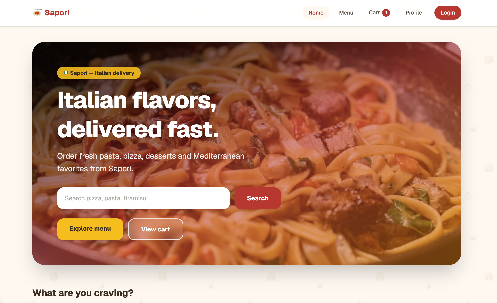
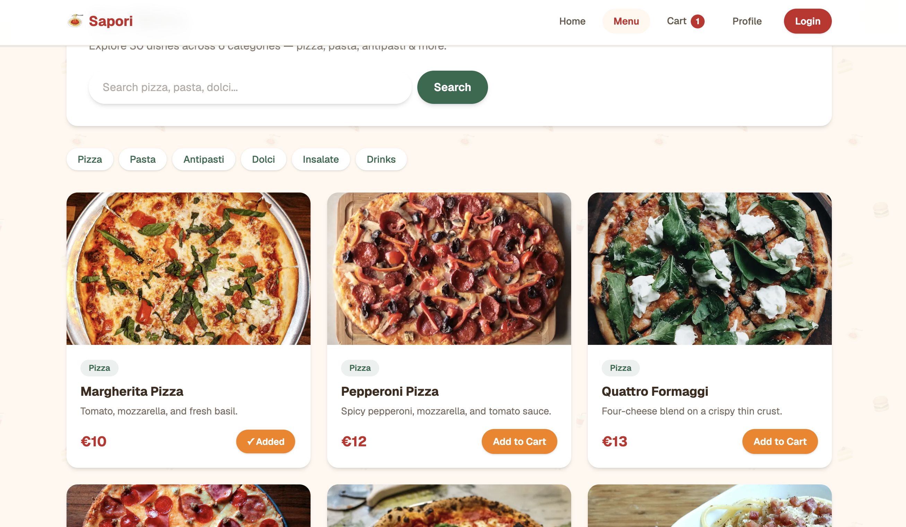
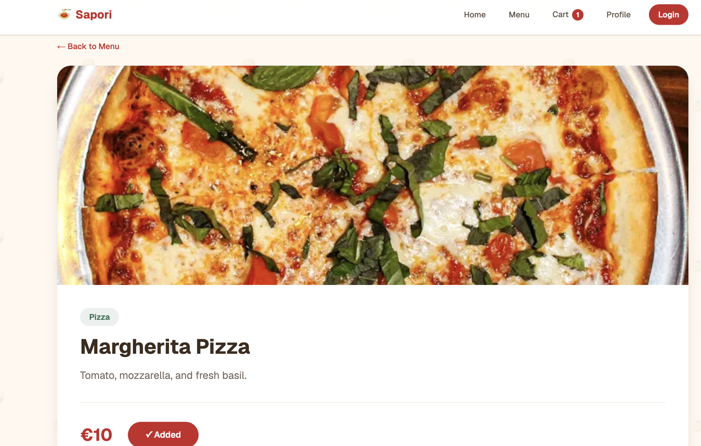
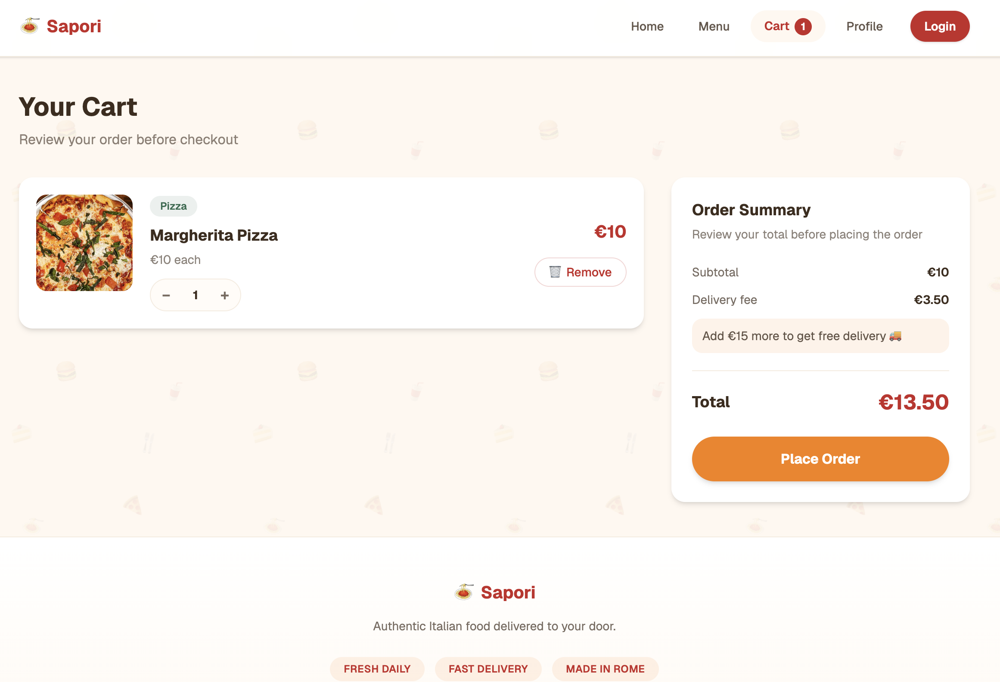
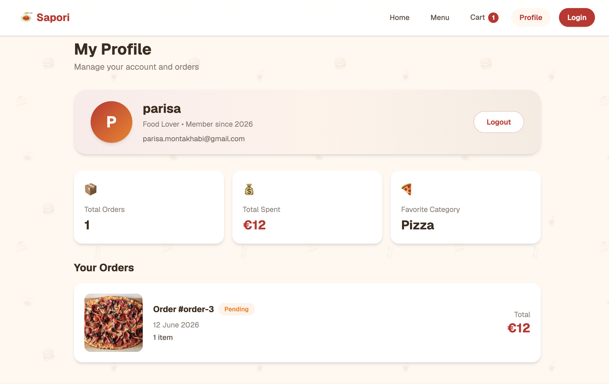

# Sapori 🍝

**Sapori – Italian Food Delivery**

A modern Italian food delivery web application built with Next.js, TypeScript, and Tailwind CSS.

---

## Overview

Sapori is a frontend-only food delivery experience inspired by apps like Glovo and Deliveroo. Users can browse an Italian menu, search dishes, manage a shopping cart, and place mock orders — all within a clean, responsive UI.

The project focuses on realistic UX patterns (cart persistence, order summaries, profile dashboard) while keeping the architecture simple and beginner-friendly for learning modern React development.

---

## Features

- 🍕 **Browse food categories** — Pizza, Pasta, Antipasti, Dolci, Insalate, and Drinks
- 📄 **Product detail pages** — Full dish info with images and add-to-cart
- 🔍 **Search menu items** — Filter the menu by name or category
- 🛒 **Shopping cart** — Quantity stepper, item removal, and cart badge in the navbar
- 🧾 **Order summary** — Subtotal, delivery fee, free-delivery progress, and sticky checkout panel
- 🔐 **Mock authentication** — Login and register with simulated auth flow
- 👤 **User profile** — Dashboard with order stats and order history
- 📦 **Order history** — View past orders with status badges
- 📱 **Responsive design** — Mobile-first layout across all pages
- 💾 **Local storage persistence** — Cart and auth state survive page refresh

---

## Tech Stack

| Category | Technology |
|----------|------------|
| Framework | [Next.js](https://nextjs.org) (App Router) |
| Language | [TypeScript](https://www.typescriptlang.org) |
| Styling | [Tailwind CSS](https://tailwindcss.com) v4 |
| UI Library | [React](https://react.dev) 19 |
| State & Storage | Local Storage, `useSyncExternalStore` |

---

## Screenshots

> Add screenshots to `docs/screenshots/` and replace the placeholders below.

| Home Page | Menu Page |
|:---------:|:---------:|
|  |  |
| *Home page placeholder* | *Menu page placeholder* |

| Product Page | Cart Page |
|:------------:|:---------:|
|  |  |
| *Product page placeholder* | *Cart page placeholder* |

| Profile Page |
|:------------:|
|  |
| *Profile page placeholder* |

---

## Demo Account

Use these credentials to explore the authenticated experience:

| Field | Value |
|-------|-------|
| **Email** | `marco@example.com` |
| **Password** | `password123` |

---

## Getting Started

```bash
# Clone the repository
git clone https://github.com/parisaMontakhab/Sapori.git
cd Sapori

# Install dependencies
npm install

# Run the development server
npm run dev
```

Open [http://localhost:3000](http://localhost:3000) in your browser.

```bash
# Production build
npm run build
npm start
```

---

## Project Structure

```
sapori/
├── app/                    # Next.js App Router pages
│   ├── page.tsx            # Home
│   ├── menu/               # Menu with search
│   ├── product/[id]/       # Product detail
│   ├── cart/               # Shopping cart
│   ├── profile/            # User profile & orders
│   ├── login/              # Login
│   └── register/           # Registration
├── components/             # Reusable UI components
├── data/                   # Mock data (users, products, orders)
├── services/               # Data access layer (mock API)
├── store/                  # Client state (auth, cart + localStorage)
├── types/                  # TypeScript interfaces
└── public/                 # Static assets (images, logo)
```

---

## Development Process

This project was developed using **AI-assisted development tools**, including:

- **Cursor AI**
- **ChatGPT**

AI was used as a development assistant for:

- UI ideation and layout polish
- Component generation and refactoring
- Debugging and troubleshooting
- Code review assistance

> **Important:** All final implementation decisions, architecture choices, testing, and validation were performed **manually by the developer**. AI suggestions were reviewed, adapted, and integrated deliberately — not copied blindly.

---

## Known Limitations

- This is currently a **frontend-only mock application**
- Authentication is **simulated** (no real server-side sessions)
- Orders and user data are stored **locally** in the browser
- No backend or database yet — services read from in-memory mock data

---

## Learning Outcomes

Building Sapori helped reinforce:

- **Next.js App Router** — Server and client components, routing, metadata
- **TypeScript** — Typed models, services, and component props
- **State management** — Cart subscriptions with `useSyncExternalStore`
- **Local storage** — Persisting cart and auth across sessions
- **Component architecture** — Separating pages, components, services, and stores
- **AI-assisted development workflow** — Using AI tools effectively while maintaining code ownership

---

## Future Improvements

- Real backend API
- Real authentication (JWT / sessions)
- Payment integration
- Live order tracking

---

## Author

**Parisa Montakhabi**

---

*Built with ❤️ and pasta.*
